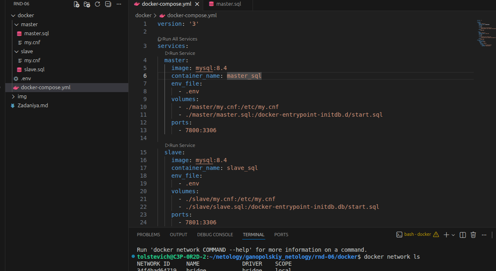
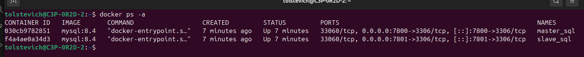
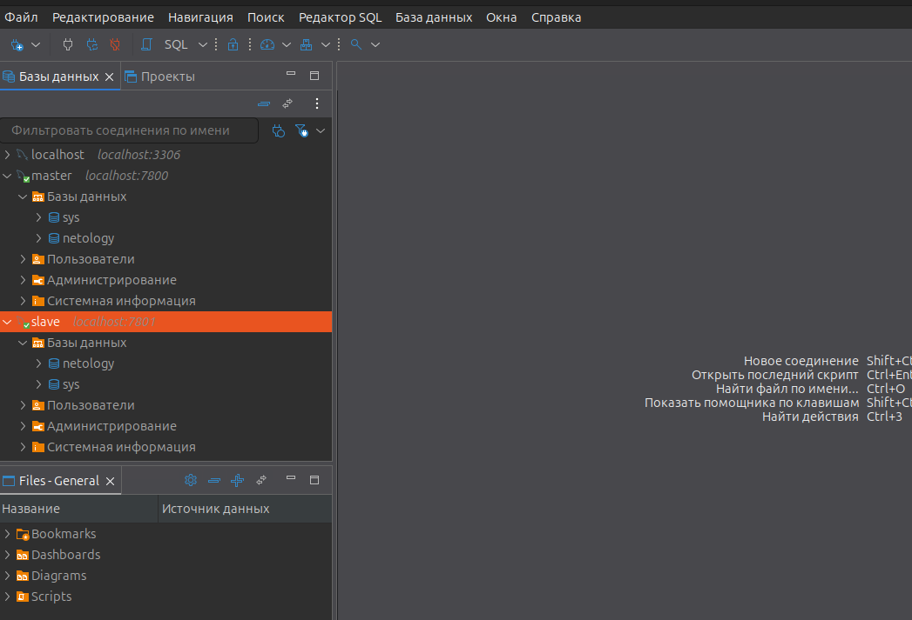
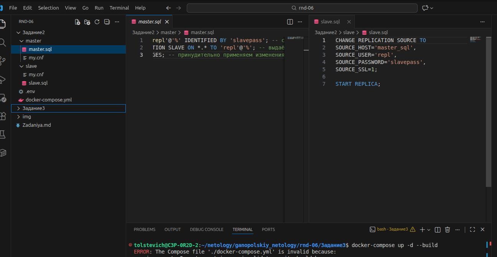
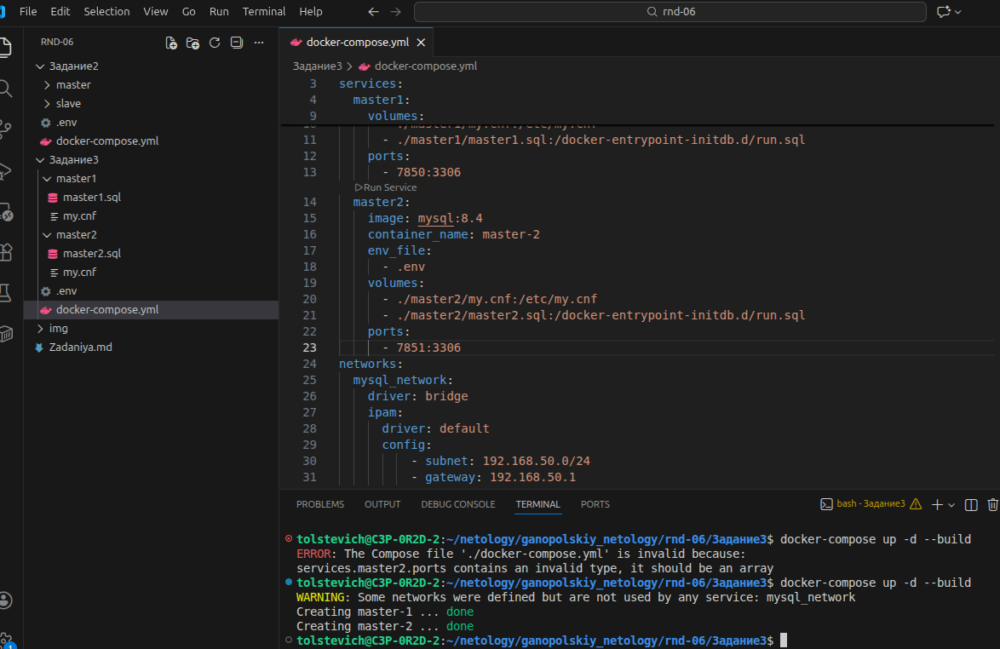
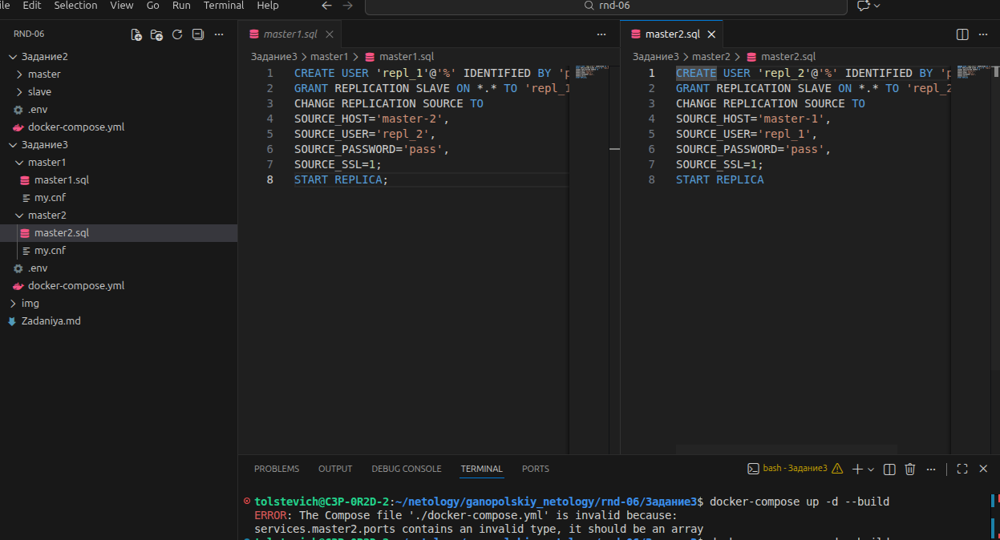
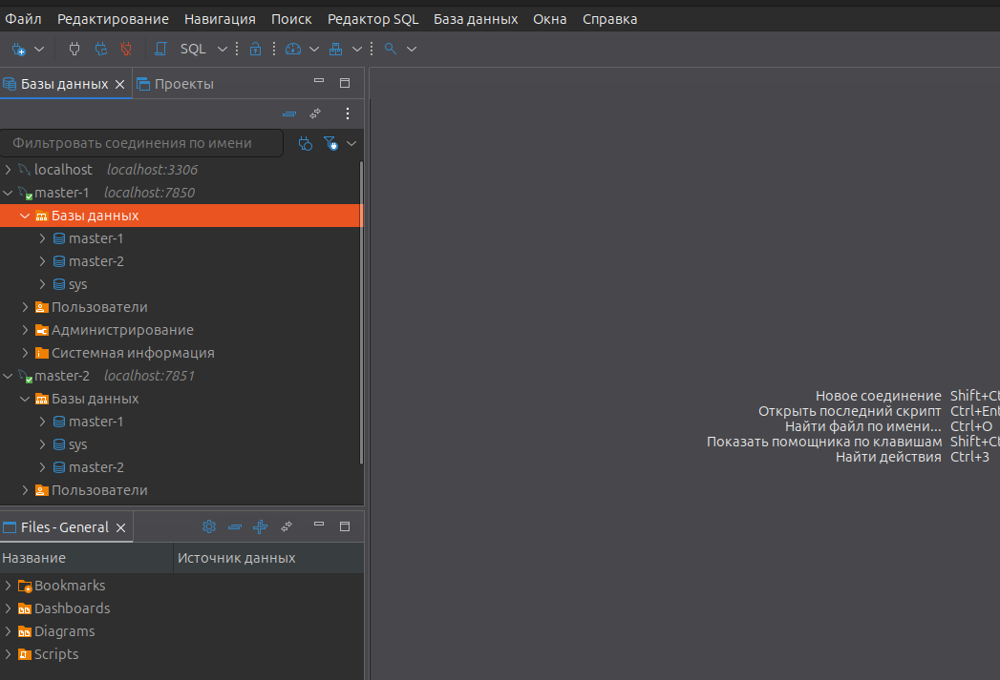

# Домашнее задание к занятию "`Репликация и масштабирование. Часть 1`" - `Ганопольский Евгений`

### Инструкция по выполнению домашнего задания

   1. Сделайте `fork` данного репозитория к себе в Github и переименуйте его по названию или номеру занятия, например, https://github.com/имя-вашего-репозитория/git-hw или  https://github.com/имя-вашего-репозитория/7-1-ansible-hw).
   2. Выполните клонирование данного репозитория к себе на ПК с помощью команды `git clone`.
   3. Выполните домашнее задание и заполните у себя локально этот файл README.md:
      - впишите вверху название занятия и вашу фамилию и имя
      - в каждом задании добавьте решение в требуемом виде (текст/код/скриншоты/ссылка)
      - для корректного добавления скриншотов воспользуйтесь [инструкцией "Как вставить скриншот в шаблон с решением](https://github.com/netology-code/sys-pattern-homework/blob/main/screen-instruction.md)
      - при оформлении используйте возможности языка разметки md (коротко об этом можно посмотреть в [инструкции  по MarkDown](https://github.com/netology-code/sys-pattern-homework/blob/main/md-instruction.md))
   4. После завершения работы над домашним заданием сделайте коммит (`git commit -m "comment"`) и отправьте его на Github (`git push origin`);
   5. Для проверки домашнего задания преподавателем в личном кабинете прикрепите и отправьте ссылку на решение в виде md-файла в вашем Github.
   6. Любые вопросы по выполнению заданий спрашивайте в чате учебной группы и/или в разделе “Вопросы по заданию” в личном кабинете.1
   
Желаем успехов в выполнении домашнего задания!рп
   

Задание 1

На лекции рассматривались режимы репликации master-slave, master-master, опишите их различия.

Ответить в свободной форме.

   Мастер-слейв репликация представляет собой основной сервер(мастер), куда идут все данные и здесь же идут изменения, запись, удаление и вторичный(слейв), куда копируется текущее состояние с мастера, с него идет чтение.
   Мастер-мастер репликация - это когда оба сервера являются и мастером и слейвом одновременно, т.е. это как мастер-слейв, только работает в обе стороны.
   Иначе говоря, у мастер-слейв запись на одном узле, у мастер-мастер на обоих. 
   Мастер-мастер более отказоустойчивый, потому как если в режиме репликации мастер-слейв на мастере база данных будет утеряна, на слейв также она исчезнет. В мастер-мастер при отключение или ещё какой проблеме одного узла, второй продолжит работу как и ранее.
   
Задание 2

Выполните конфигурацию master-slave репликации, примером можно пользоваться из лекции.

Приложите скриншоты конфигурации, выполнения работы: состояния и режимы работы серверов.

Docker-compose

Состояние контейнеров

Репликация прошла успешно)))

Конфигурация

Дополнительные задания (со звёздочкой*)

Эти задания дополнительные, то есть не обязательные к выполнению, и никак не повлияют на получение вами зачёта по этому домашнему заданию. Вы можете их выполнить, если хотите глубже шире разобраться в материале.

Задание 3*

Выполните конфигурацию master-master репликации. Произведите проверку.

Приложите скриншоты конфигурации, выполнения работы: состояния и режимы работы серверов.

Docker-compose

Конфигурация

Репликация успешно проходит

