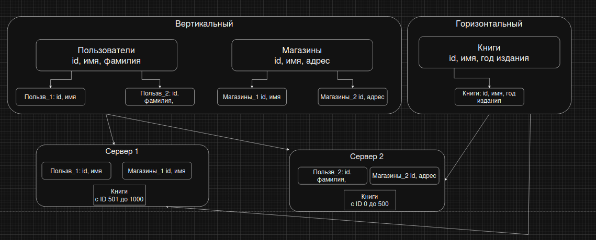

# Домашнее задание к занятию "`Репликация и масштабирование. Часть 2`" - `Ганопольский Евгений`

### Инструкция по выполнению домашнего задания

   1. Сделайте `fork` данного репозитория к себе в Github и переименуйте его по названию или номеру занятия, например, https://github.com/имя-вашего-репозитория/git-hw или  https://github.com/имя-вашего-репозитория/7-1-ansible-hw).
   2. Выполните клонирование данного репозитория к себе на ПК с помощью команды `git clone`.
   3. Выполните домашнее задание и заполните у себя локально этот файл README.md:
      - впишите вверху название занятия и вашу фамилию и имя
      - в каждом задании добавьте решение в требуемом виде (текст/код/скриншоты/ссылка)
      - для корректного добавления скриншотов воспользуйтесь [инструкцией "Как вставить скриншот в шаблон с решением](https://github.com/netology-code/sys-pattern-homework/blob/main/screen-instruction.md)
      - при оформлении используйте возможности языка разметки md (коротко об этом можно посмотреть в [инструкции  по MarkDown](https://github.com/netology-code/sys-pattern-homework/blob/main/md-instruction.md))
   4. После завершения работы над домашним заданием сделайте коммит (`git commit -m "comment"`) и отправьте его на Github (`git push origin`);
   5. Для проверки домашнего задания преподавателем в личном кабинете прикрепите и отправьте ссылку на решение в виде md-файла в вашем Github.
   6. Любые вопросы по выполнению заданий спрашивайте в чате учебной группы и/или в разделе “Вопросы по заданию” в личном кабинете.1
   
Желаем успехов в выполнении домашнего задания!рп
   

Задание 1

Опишите основные преимущества использования масштабирования методами:

    активный master-сервер и пассивный репликационный slave-сервер;
    master-сервер и несколько slave-серверов;

Дайте ответ в свободной форме.

1. Активный master-сервер и пассивный репликационный slave-сервер

Если мастер-сервер упал, слейв можно быстро перевести в активный режим.
Все запросы на чтение можно перевести на слейв-сервер, тем самым уменьшив нагрузку на мастера.

2. master-сервер и несколько slave-серверов

Как ответил выше, тут можно также все запросы перевести на слейв-сервера, но распределить равномерно, тем самым увеличив общую производительность и большее количество запросов на чтение обрабатывать.
Слейв-сервера можно распределить по разным городам, тем самым ускорив доступ к данным пользователям.
Если один слейв-сервер выйдет из строя, остальные продолжат работать в штатном режиме.

Задание 2

Разработайте план для выполнения горизонтального и вертикального шаринга базы данных. База данных состоит из трёх таблиц:

    пользователи,
    книги,
    магазины (столбцы произвольно).

Опишите принципы построения системы и их разграничение или разбивку между базами данных.

Пришлите блоксхему, где и что будет располагаться. Опишите, в каких режимах будут работать сервера.

Вертикальный шардинг применяется, когда таблица слишком разрастается в ширь. Какие-то столбцы могут использоваться для разных целей, а какие-то становятся слишком тяжелыми или редко используемыми.

Горизонтальный шардинг — как я понял более распространен, чем вертикальный. Таблица делится на шарды по строкам по ключу шардирования (id/имя/год издания), это сделано для того, чтоб каждый сервер хранил только свой определенный диапозон данных. А приложение, имея ключ, знает на какой именно сервер ей нужно идти за необходимыми данными.

