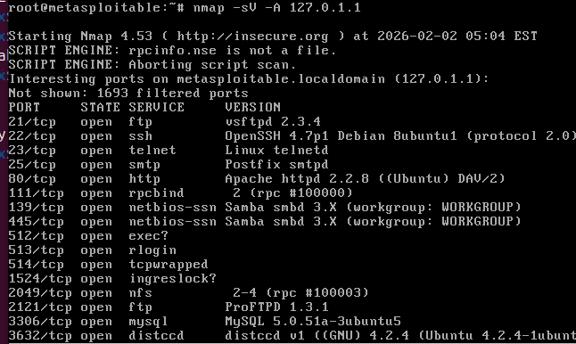
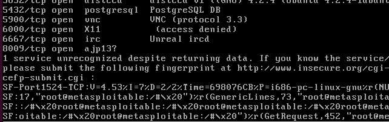

# Домашнее задание к занятию "`Уязвимости и атаки на информационные системы`" - `Ганопольский Евгений`

### Инструкция по выполнению домашнего задания

   1. Сделайте `fork` данного репозитория к себе в Github и переименуйте его по названию или номеру занятия, например, https://github.com/имя-вашего-репозитория/git-hw или  https://github.com/имя-вашего-репозитория/7-1-ansible-hw).
   2. Выполните клонирование данного репозитория к себе на ПК с помощью команды `git clone`.
   3. Выполните домашнее задание и заполните у себя локально этот файл README.md:
      - впишите вверху название занятия и вашу фамилию и имя
      - в каждом задании добавьте решение в требуемом виде (текст/код/скриншоты/ссылка)
      - для корректного добавления скриншотов воспользуйтесь [инструкцией "Как вставить скриншот в шаблон с решением](https://github.com/netology-code/sys-pattern-homework/blob/main/screen-instruction.md)
      - при оформлении используйте возможности языка разметки md (коротко об этом можно посмотреть в [инструкции  по MarkDown](https://github.com/netology-code/sys-pattern-homework/blob/main/md-instruction.md))
   4. После завершения работы над домашним заданием сделайте коммит (`git commit -m "comment"`) и отправьте его на Github (`git push origin`);
   5. Для проверки домашнего задания преподавателем в личном кабинете прикрепите и отправьте ссылку на решение в виде md-файла в вашем Github.
   6. Любые вопросы по выполнению заданий спрашивайте в чате учебной группы и/или в разделе “Вопросы по заданию” в личном кабинете.1
   
Желаем успехов в выполнении домашнего задания!

 

Задание 1

Скачайте и установите виртуальную машину Metasploitable: https://sourceforge.net/projects/metasploitable/.

Это типовая ОС для экспериментов в области информационной безопасности, с которой следует начать при анализе уязвимостей.

Просканируйте эту виртуальную машину, используя nmap.

Попробуйте найти уязвимости, которым подвержена эта виртуальная машина.

Сами уязвимости можно поискать на сайте https://www.exploit-db.com/.

Для этого нужно в поиске ввести название сетевой службы, обнаруженной на атакуемой машине, и выбрать подходящие по версии уязвимости.

Ответьте на следующие вопросы:

    Какие сетевые службы в ней разрешены?
    Какие уязвимости были вами обнаружены? (список со ссылками: достаточно трёх уязвимостей)

Приведите ответ в свободной форме.

### Решение задания 1

Разрешенные сетевые службы:

    FTP (21/tcp) - vsftpd 2.3.4

    SSH (22/tcp) - OpenSSH 4.7p1

    Telnet (23/tcp) - Linux telnetd

    SMTP (25/tcp) - Postfix

    HTTP (80/tcp) - Apache 2.2.8

    RPC (111/tcp) - rpcbind

    Samba (139,445/tcp) - Samba smbd 3.X

    exec/rlogin (512-514/tcp)

    ingreslock (1524/tcp)

    NFS (2049/tcp)

    FTP (2121/tcp) - ProFTPD 1.3.1

    MySQL (3306/tcp) - MySQL 5.0.51a

    distcc (3632/tcp) - distccd

Какие уязвимости были вами обнаружены? (список со ссылками: достаточно трёх уязвимостей)

1. FTP (21/tcp) - vsftpd 2.3.4. Ссылка: https://www.exploit-db.com/exploits/49757
   Бэкдор для выполнения удаленных команд.
2. FTP (2121/tcp) - ProFTPD 1.3.1 Ссылка: https://www.exploit-db.com/exploits/32798
   Позволяет производить манипуляции с sql-запросами, изменять данные и т.п.

3. MySQL (3306/tcp) - MySQL 5.0.51a Ссылка: https://www.exploit-db.com/exploits/33077
   Позволяет запускать произвольный код

Задание 2

Проведите сканирование Metasploitable в режимах SYN, FIN, Xmas, UDP.

Запишите сеансы сканирования в Wireshark.

Ответьте на следующие вопросы:

    Чем отличаются эти режимы сканирования с точки зрения сетевого трафика?
    Как отвечает сервер?

Приведите ответ в свободной форме.

### Решение задания 2

1. Сканирование в режиме SYN, команда: sudo nmap -sS 192.168.56.101

Nmap как бы "спрашивает", у тебя порт 22 открыт?
 - Да;
 - Спасибо, пока!

Схема такая: SYN - SYN,ACK - RST (Если открыт) и: SYN - RST,ACK, если закрыт.

[Задание 2](./img/2.png)

2. Сканирование в режиме FIN, команда: sudo nmap -sF 192.168.56.101

Тут схема уже такая: nmap отправляет закрытие соединения(FIN). Если порт молчит - он открыт, если закрыт - RST

[Задание 2](./img/2.1.png)

3. Сканирование в режиме Xmas, команда: sudo nmap -sX 192.168.56.101

nmap использует в заголовках протокола TCP, так называемую "Ёлку" в флагах: FIN, URG. Ответ точно такой же, как в FIN скане. Молчание - порт открыт, RST - закрыт.

[Задание 2](./img/2.2.png)

4. Сканирование в режиме UDP, команда: sudo nmap -sU 192.168.56.101

UDP, протокол без установления соединения. nmap отправляет udp-пакеты и ждёт ответа: icmp port unreachable - порт закрыт, молчание - открыт.

[Задание 2](./img/2.3.png)